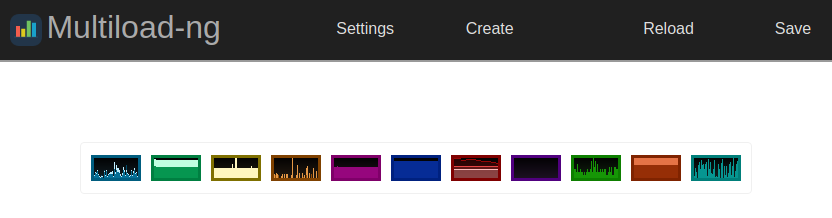

# Multiload-ng Server

This is a temporary README. You can get a better idea of how Multiload-ng
works in top directory [README](../README.md).

## Overview

Multiload-ng Server is a Multiload-ng target running as a HTTP daemon,
drawing system resources usage in a nice web interface.

It can be used in any system, including *headless* (those without a
graphical environment). Web interface is accessible from machine itself,
and from other machine in the same LAN.  
With additional configuration (that depends on your system) you can make
Multiload-ng Server visible from the outside of your network too.

Remember that Multiload-ng Server is still in beta.

## Features

- Collect resources usage in pretty graphs
- Full fledged Multiload-ng experience, running in your browser
- Save and load stored configuration. The same configuration can be used with
  other Multiload-ng targets (like panel plugins)
- Basic and Digest authentication
- Exhaustive logging to console
- Port selection

## Required dependencies

You have to install [libmultiload](../../libmultiload/README.md) before building
and using Multiload-ng Server.

In addition, Multiload-ng Server requires [libmicrohttpd](https://www.gnu.org/software/libmicrohttpd/) for HTTP server
functionality. Refer to your distro documentation for install instructions.

## How to build and run Multiload-ng Server

Multiload-ng Server does still not have an installation procedure. It needs
to be run directly from source directory.

Once you have installed required dependencies (see [above](#required-dependencies)),
just open a terminal in this directory, and type:

	make

If command succeeds, Multiload-ng Server is ready for use. Just type:

	./multiload-ng-server

and the server will start.

To list available command line options, type: `./multiload-ng-server --help`
